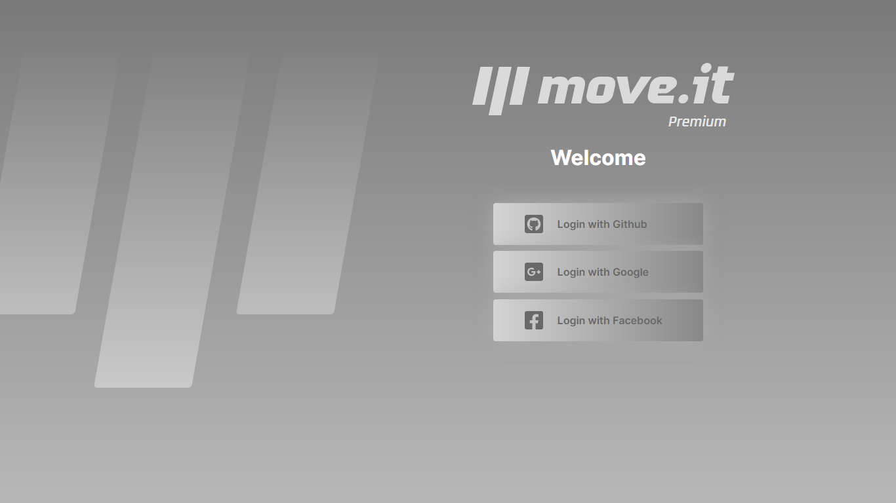
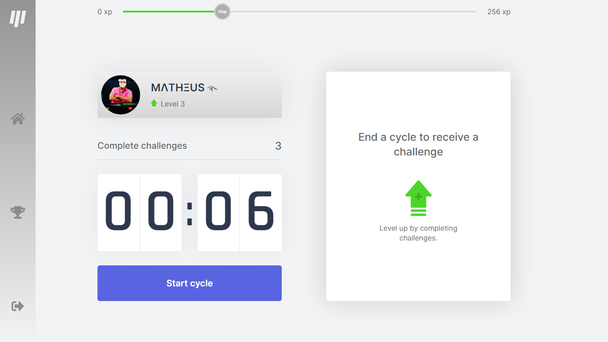
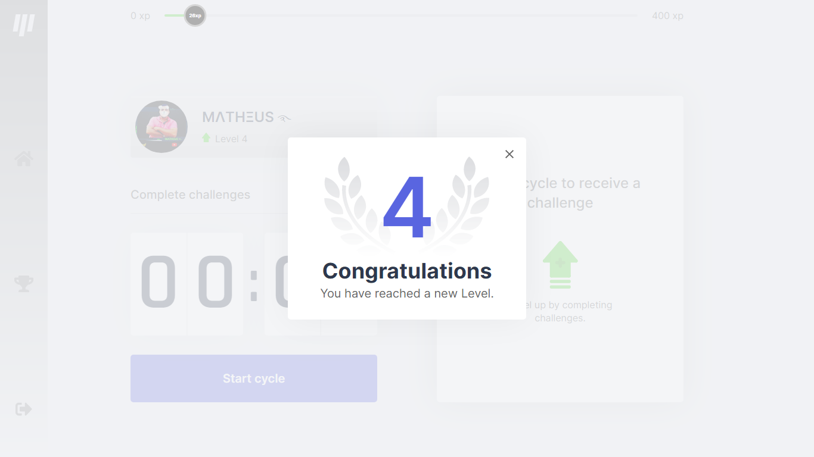
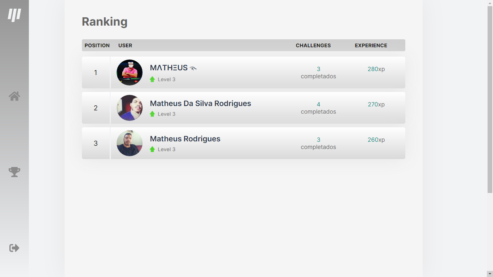

<p align="center">
	
  
 
</p>

<h4 align="center"> 
	🚧 Application under construction! 🚧
</h4>

##  👨‍💻Technologies used  ##

<p align="center">
&nbsp&nbsp&nbsp&nbsp&nbsp&nbsp&nbsp&nbsp&nbsp&nbsp&nbsp&nbsp
&nbsp&nbsp&nbsp&nbsp&nbsp&nbsp&nbsp&nbsp&nbsp&nbsp&nbsp&nbsp
&nbsp&nbsp&nbsp&nbsp&nbsp&nbsp&nbsp&nbsp&nbsp&nbsp&nbsp&nbsp	
&nbsp&nbsp&nbsp&nbsp&nbsp&nbsp&nbsp&nbsp&nbsp&nbsp&nbsp&nbsp

</p>

## 💻 Project information

The system is based on the Pomodoro technique, which consists of activities performed at intervals of 25 minutes. For more information visit the link: 🌐https://pt.wikipedia.org/wiki/T%C3%A9cnica_pomodoro.


---

<a name="-funcionalidades"></a>

## ⚙️ Functionalities

 ☑ Home;<br>
 ☑ Timer;<br>
 ☑ Experience Bar;<br>
 ☑ Challenges;<br>
 ☑ Failed Button - Cancels Challenge and Timer Reset;<br>
 ☑ Complete Button - Adds Challenge Experience and Timer Reset;<br>
 ☑ Displays a Modal when user level up;<br>
 ☑ User data is saved in cookies;<br>

### A milha extra...
✅ Routes for using MongoDB as an application database have been added;<br>
✅ A Side Bar has been created;<br>
✅ Navigation between Main page and Rankings;<br>
✅ LogOut button;<br>
✅ Login Page;<br>
✅ Complete Layout;<br>
✅ Login by Github with NextAuth;<br>
✅ Login by Google with NextAuth;<br>
✅ Login by Facebook with NextAuth;<br>
✅ User registered in database (if it does not exist);<br>
✅ Home:<br>
✅ User data is updated;<br>
✅ Rankings Page;<br>
✅ Full Layout - Premium Version;<br>
✅ Ranking with experience levels;<br>


### Future Updates...
🔨-Deploy for production;<br>
🔨-Responsive for mobile devices;<br>
🔨-Addition of ranking with three levels (gold, silver and bronze);<br>
🔨-Adding friendships button (add friends);<br>
🔨-Added dark and light theme;

---

## 🎨 Layout

### Login Page

<div align="center">
    
</div>

### Home

<div align="center">
    
</div>

### Modal level up

<div align="center">
    
</div>

### Rankings Page

<div align="center">
    
</div>

---

## 🚀How to run the project?

To execute this project it is necessary to install some tools and libraries.

###  Requirements

[Git]🌐(https://git-scm.com);br> [Node.js]🌐(https://nodejs.org/en/);<br> [Yarn]🌐(https://classic.yarnpkg.com/en/docs/install);<br>
Text Editor: [VSCode]🌐(https://code.visualstudio.com/).

### ⚠️ Environment Variables
---
⚙️Environment variables are inserted into a file at the root of the project, (src folder), with the name <strong>.env</strong>.<br>

<h4>###Variables for auth app connecting to GitHub:</h4>
  🔑GITHUB_CLIENT_ID="Provided in the auth app";<br>
  🔑GITHUB_CLIENT_SECRET="Provided in the auth app".
<h4>#Variables for auth app connecting to Google:</h4> 
  🔑GOOGLE_CLIENT_ID="Provided in the auth app";<br>
  🔑GOOGLE_CLIENT_SECRET="Provided in the auth app".
<h4>#Variables for auth app connecting to Facebook:</h4>
  🔑FACEBOOK_CLIENT_ID="Provided in the auth app";<br>
  🔑FACEBOOK_CLIENT_SECRET"Provided in the auth app".
<h4>#Variables with site base URLs:</h4>
  🌐NEXTAUTH_URL="Base URL of your site. Ex.: http://localhost:3000 ou https://moveit-premium.vercel.app/".
<h4>#A random text string that is used in NextAuth:</h4>
  🔑AUTH_SECRET="...";<br>
  🔑JWT_SECRET="...".
<h4>#URL for connection to MongoDB database:</h4>
  🌐MONGODB_URI="...".


---
 ⚙️ To run this system you must perform the following steps:

<strong>in your text editor's terminal enter the following commands:</strong>
```bash
# Clone this repository
$ git clone https://github.com/MTheusRodrigues/Moveit-Premium.git

# Go to the project folder 
$ cd moveit-premium

# Install dependencies
$ yarn install

# Install some necessary tools
$ yarn add mongodb;
$ yarn add @types/mongodb -D;
$ yarn add @vercel/node;
$ yarn add next-auth;
$ yarn add axios;
$ yarn add @fortawesome/free-solid-svg-icons;
$ yarn add @fortawesome/react-fontawesome;
$ yarn add add @fortawesome/fontawesome-svg-core;
$ yarn add typescript @types/react @types/react-dom @types/node -D;
$ yarn add js-cookie;
$ npm i react-router-dom;

# Run the application in development mode
$ yarn dev

# The application will open on the door:3000 - in your browser go to http://localhost:3000

```

---

## 🛠 Technologies

Tools used for system construction:

#### **Website** ([React](https://reactjs.org/) + [TypeScript](https://www.typescriptlang.org/))

- **[Next.js]🌐(https://nextjs.org/)**
- **[Context]🌐(https://pt-br.reactjs.org/docs/context.html)**
- **[js-cookie]🌐(https://github.com/js-cookie/js-cookie)**
- **[css-Modules]🌐(https://github.com/css-modules/css-modules)**
- **[MongoDB]🌐(https://www.mongodb.com/)**
- **[Next-Auth]🌐(https://next-auth.js.org/)**
- **[React Icons]🌐(https://react-icons.github.io/react-icons/)**

 Go to the package.json file for more information [package.json]🌐(https://github.com/MTheusRodrigues/Moveit-Premium/blob/main/package.json)

 **Utilities**

- Editor: **[Visual Studio Code]🌐(https://code.visualstudio.com/)**
- Fonts: **[Rajdhani]🌐(https://fonts.google.com/specimen/Rajdhani)**, **[Inter]🌐(https://fonts.google.com/specimen/Inter)**
- FontWaesome 5.15.3 **🌐(https://cdnjs.cloudflare.com/ajax/libs/font-awesome/5.15.3/css/all.min.css)**
---

<a name="-autor"></a>

## 🦸‍♂️ **Autor**

<p>
<kbd>
 
 </kbd>
 <br />
 <sub><strong>🌟 Matheus Rodrigues 🌟</strong></sub>
</p>

Linkedin:👨‍💼(https://www.linkedin.com/in/matheus-rodrigues-570759184)<br>
Email:📧(mailto:matheusrmo@outlook.com)

---

## 📝 License
 [MIT](./LICENSE).

Matheus Rodrigues 🏽 [Entre em contato!](https://www.linkedin.com/in/matheus-rodrigues-570759184)

---
## **Contributions and References**
🚀Rocketseat:https://rocketseat.com.br/;<br>
👨‍💼Guilherme Rocha:https://github.com/grochavieira Linkedin:https://www.linkedin.com/in/grochavieira/;<br>
▶️Serverless com ReactJS e Next.js na Vercel | Code/Drops #54:https://www.youtube.com/watch?v=Cz55Jmhfw84;<br>
▶️AUTENTICAÇÃO COM NEXT-AUTH [PARTE #09]:https://www.youtube.com/watch?v=lINOGJ2a5J4&t=447s;<br>
▶️Adding Authentication to Next.js:https://www.youtube.com/watch?v=3q4BtCzuryY&t=1243s.<br>
